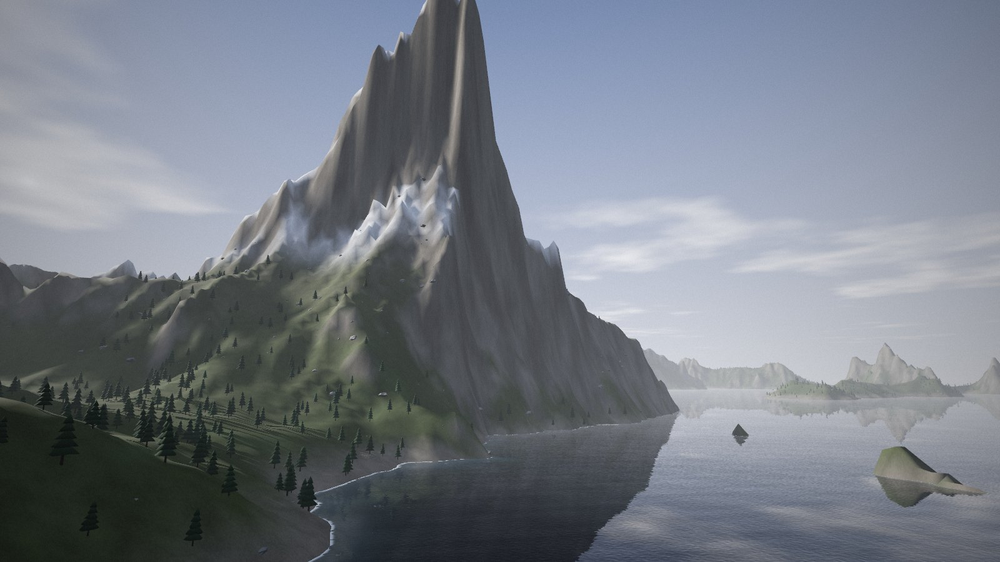
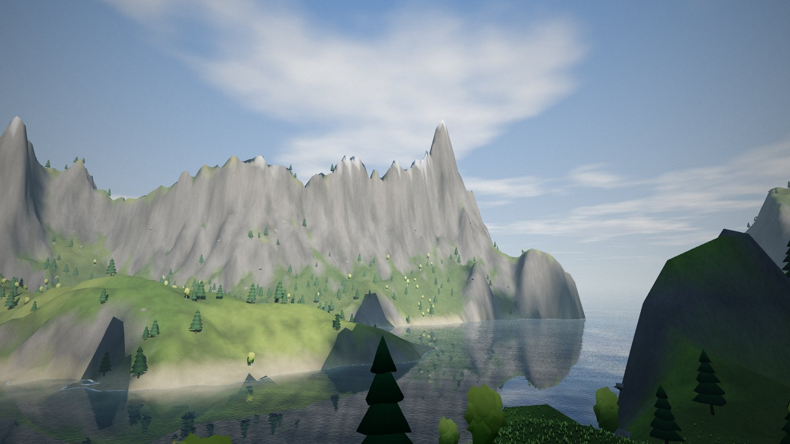
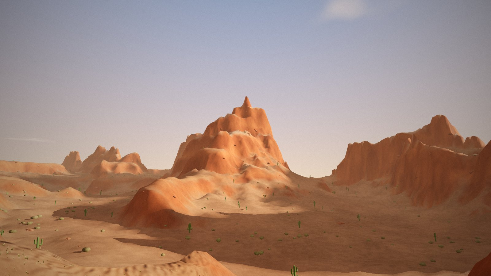
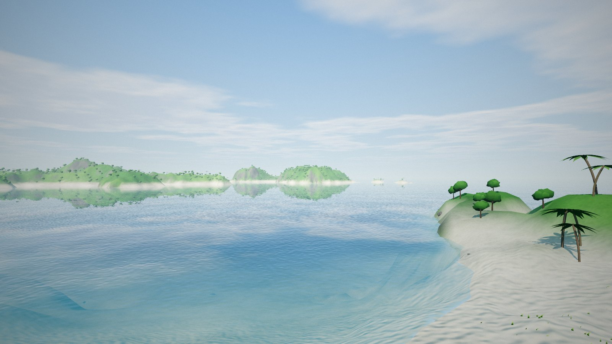
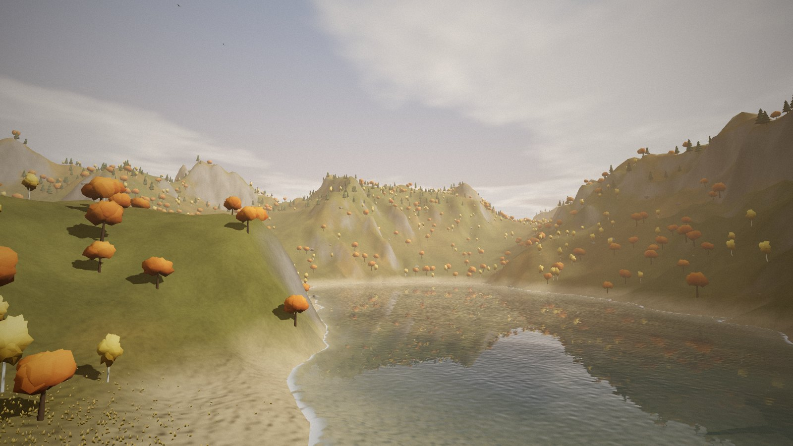

# Landscape Forge

Procedural 3D landscapes you can fly through in a browser. Each world is made from a seed and a short list of settings: mountains, lakes, forests, grass, weather, time of day and an art style. Everything is one HTML file with no build step. The only dependency is [three.js](https://threejs.org/) 0.186.1, loaded from a CDN.

**▶ [Play it on GitHub Pages](https://boxwrench.github.io/landscape-forge/)** · **[Original Claude artifact](https://claude.ai/artifact/1MDssNSsaCjK7pcVJ2KLxZ)**

[](https://boxwrench.github.io/landscape-forge/)

It comes with five worlds:

| Thornwood Lake | Vermilion Mesa |
|---|---|
|  |  |
| Pine and birch forest around a mountain lake, with snow on the peaks | Stepped red-rock mesas with banded cliffs, cactus and scrub |
| **Coral Atoll** | **Emberfall Highlands** |
|  |  |
| A tropical island with palms, white beaches and turquoise shallows | Autumn hills in morning haze, with orange and gold trees |

The fifth, **Glacier Fjord** (the large image above), has steep peaks dropping into dark water under a low winter sun.

*All screenshots are in the default Natural style. Painterly, Cel and Watercolor are one keypress away.*

## Controls

| Input | Action |
|---|---|
| Drag | Look around (double-click to lock the mouse) |
| W A S D / arrows | Move · Shift to go faster · Q / E to go down and up |
| F | Switch between flying and walking |
| T | Guided tour (press any move key to take over) |
| 1 – 4 | Art style: Natural, Painterly, Cel, Watercolor |
| H | Hide the interface |
| Touch | Drag on the left part of the screen to move, anywhere else to look |

The panel also has sliders for terrain shape, a **Surprise me** button, **Copy world** / **Load world** for sharing worlds as JSON, and a Light/Full quality switch for weaker devices.

---

## How it works

Everything lives in one `<script type="module">` in `index.html`, in this order from top to bottom. A world is built in stages, and a progress bar shows each one.

### 1. Heightfield (the shape of the land)
The terrain is a 513 × 513 grid of heights covering 4 km by default.
- **Seeded noise.** A small simplex noise is driven by a `mulberry32` random number generator, so the same seed always gives the same world.
- **fbm + ridged noise.** Stacked layers ("octaves") of noise make rolling ground. Ridged noise (`1 - |noise|`) makes sharp mountain crests. `ridge` blends between the two.
- **Domain warping.** A second noise field pushes the sample coordinates around before sampling (`warp`), which bends landforms into more natural shapes.
- **Shaping.** `sharpness` raises heights to a power, which flattens valleys and lifts peaks. `terrace` quantises height into steps for mesas. `island` lowers the edges into the sea.

### 2. Hydraulic erosion
This is the step that makes the land look worn by weather. Tens of thousands of simulated raindrops each roll downhill over the grid. A drop picks up sediment where it speeds up and drops it where it slows down or evaporates. That carves gullies into slopes and leaves fans of silt at their feet. The work is done in batches between frames so the page stays responsive. The `erosion` setting controls how much rain falls.

### 3. Ground painting
Every terrain vertex gets a colour from its height and slope: lake bed → beach → low growth → high meadow → rock on steep slopes → snow above the snow line. Mesas get extra horizontal rock bands (`strata`). Eroded silt shows up in its own colour.

### 4. Mountain shadows
Shadow maps only reach a few hundred metres, so distant peaks would never shade their valleys. To fix that, the CPU ray-marches the heightfield toward the sun into a 256 × 256 shade texture. It is recomputed whenever the sun moves, and the terrain, trees and grass all sample it.

### 5. Shared shader code
`patchStandard()` adds code to three.js's `MeshStandardMaterial` through `onBeforeCompile`. That gives every object the same height fog, moving cloud shadows, mountain-shadow lookup and (for plants) wind sway, while keeping three's normal PBR lighting.

### 6. Trees and rocks
Six tree types (pine, broadleaf, birch, palm, cactus, shrub) are built from code: three.js primitives are deformed with noise, coloured per vertex and merged into one geometry each. Trees are placed on a jittered grid. Each tree type has its own height range, slope limit and "clump" noise, so forests grow in patches instead of spreading evenly. The trees are split into chunked `InstancedMesh` objects so that chunks out of view are skipped.

### 7. Grass
About 150,000 instanced blades (at Full quality) sit on a patch that wraps around the camera, so the grass seems endless while the blade count stays fixed. Each blade reads the ground height, slope and density from textures in the vertex shader, bends in the wind, and fades out with distance. Flowers are a small share of blades with a different colour.

### 8. Water
A flat plane with a **planar reflection**: a second camera mirrored below the water renders the scene into a texture. The water shader compares the water level with the heightfield to tint deep and shallow water, and adds foam along the shore, moving ripples and sun glints.

### 9. Sky, sun and mood
The sky is a gradient dome with procedural clouds. The sun's position comes from the hour (`time`), the noon height (`sunPeak`) and the direction (`sunAzimuth`), and it colours the light, sky and fog toward sunset. Birds are a small flock of instanced meshes flying on looping paths.

### 10. Post-processing
three.js's `EffectComposer` chain: render → **light shafts** (a radial blur from the sun's position on screen) → **bloom** → tone mapping → a final **style pass**. That last pass also handles exposure, contrast, saturation, warmth, vignette and film grain, and switches between the four styles:
- **Natural**: just the colour grading.
- **Painterly**: a Kuwahara filter, which smooths colour into flat brush-like patches while keeping edges sharp.
- **Cel**: a light Kuwahara pass plus banded shading and dark outlines.
- **Watercolor**: soft washes, darker pigment at edges, and paper grain.

### Camera and interface
Fly and walk modes (walking keeps you at eye height above the ground or water), a guided tour along a spline through viewpoints picked for the current world, keyboard, mouse and touch input, and the settings panel. The last world you loaded is saved in `localStorage`, so a reload brings you back to it.

---

## Making your own worlds

There are three ways to do it, from easiest to most involved.

### A. In the page: no code
1. Open the page and move the **Shape** sliders. The world rebuilds when you let go.
2. Press **Copy world**. This copies the full settings as JSON.
3. Edit the JSON in any text editor (colours, trees, sky, mood and so on), then paste it into **Load world**.
4. Send that JSON to a friend and they can load the same world.

### B. Add a preset to the code
Open `index.html`, find `const PRESETS = {`, copy an entry and change it:

```js
dunes: {
  name: "Saffron Dunes", seed: 4242, time: 17.8,
  terrain: { height: 220, feature: 700, ridge: 0.7, warp: 0.6, sharpness: 1.1, erosion: 0.2, water: 0 },
  ground: { low: "#d9a55b", low2: "#e8bc74", high: "#c98f4a", sand: "#f0cf8f", snowLine: 9 },
  sky: { zenith: "#3d78c2", horizon: "#f2d6a8", clouds: 0.05, fog: 0.0004 },
  grass: { density: 0.05 },
  trees: [{ type: "cactus", density: 0.08, size: [4, 7], leaf: "#5b7a3a", leaf2: "#7d9a4a", trunk: "#5b7a3a", min: 0, max: 1, slope: 0.3, clump: 0.2 }],
  mood: { warmth: 0.4, bloom: 0.5 }
}
```

You only need to list what is different. Anything you leave out comes from `DEFAULT_WORLD`, which sits just above `PRESETS` with a comment on every field. Some useful ones:

| Setting | Effect |
|---|---|
| `seed` | A different number gives a different landscape with the same character |
| `time`, `sunPeak`, `sunAzimuth` | Time of day, how high the sun gets, which way the light comes from |
| `terrain.height` / `feature` | How tall the mountains are, and how wide |
| `terrain.ridge` / `warp` / `sharpness` | Smooth or jagged, straight or twisted, flat or deep valleys |
| `terrain.terrace` / `island` / `erosion` / `water` | Mesas, an island in the sea, weathering, lake or sea level (0 = dry) |
| `ground.*` | Ground colours and the heights and slopes where sand, rock and snow appear (`snowLine: 9` turns snow off) |
| `trees[]` | Any mix of the six types, each with its own colours, size range, height band (`min`/`max`), maximum slope and clumping |
| `sky.*` / `mood.*` | Sky colours, cloud cover, haze, light shafts, and colour grading |

The preset gets a button in the panel automatically.

### C. Go further in the code
- **New tree type:** copy one of the builders in `TREE_BUILDERS` (each returns merged geometry made from primitives) and add its name to `TREE_TYPES`.
- **New art style:** add a branch to `StyleShader`'s fragment shader (`uStyle == 4`) and a name to `STYLES`.
- **Different terrain:** `buildField()` is the place to try other noise or shaping. Every later stage reads the heightfield, so painting, trees, water and shadows follow along.

### Making your own version with Claude
This started as a Claude artifact, and Claude can keep building on it. Give it `index.html` (or the artifact link) and describe what you want, for example "add a volcano preset with lava rivers", "add a snowfall effect" or "make an alien world with purple grass".

## Running it locally

It has to be served over http, because ES modules don't load from `file://`:

```
python3 -m http.server     # then open http://localhost:8000/
# or
npx serve .
```

It needs an internet connection to load three.js, and a browser with WebGL2.

## Files

- `index.html`: the full page.
- `artifact.html`: the same code without the `<html>`/`<head>` wrapper. This is the version published as the Claude artifact.
- `tests/`: headless screenshot scripts used during development (below).

### Screenshot tests
```
cd tests
npm install
node run2.mjs .. thornwood,mesa,atoll,emberfall,fjord   # one screenshot per preset
node run3.mjs ..                                       # interface, walking view, styles, phone width
node shot.mjs thornwood,fjord ../screenshots           # 1600×900 README screenshots, interface hidden
```
The scripts point at Chromium in `/opt/pw-browsers/chromium-1194/chrome-linux/chrome`. `shot.mjs` uses Playwright's Chromium from `~/.cache/ms-playwright`. Change `executablePath` in each script to your own Chrome or Chromium. They serve three.js from `tests/node_modules` instead of the CDN. Software rendering is slow, so expect them to take a few minutes.
